# Pickle Rick


Dificultad -> Easy

Enlace a la máquina -> [TryHackme](https://tryhackme.com/room/picklerick)

-----------
## WriteUp Pickle Rick

Lo primero que vamos a hacer, como siempre, es comprobar la conectividad con la máquina objetivo.  

```bash
ping -c 1 <IP_Objetivo>
```
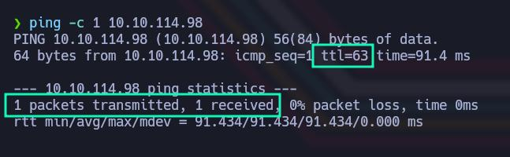

Enviamos un paquete y recibimos un paquete. Esto significa que la máquina está activa. Un pequeño truco también para conocer desde un primer momento ante qué tipo de máquina nos estamos enfrentando, es fijarnos en el valor del TTL. Aunque puede ser modificado, de forma estándar si el valor es de 64 o cercano a él, podemos intuir que vamos a enfrentarnos a un Linux; mientras que si es de 128 o cercano a él, podríamos pensar que estamos enfrentándonos a un Windows. En este caso, podemos intuir que vamos a enfrentarnos a un Linux. 

Si queremos analizar un poco más porque se pierde un valor, es porque hay un nodo intermedio, podemos verlo metiéndole el parámetro -R al comando ping utilizado. Como vemos, el paquete ICMP enviado, ha pasado por un nodo intermedio antes de llegar a nuestra máquina. 

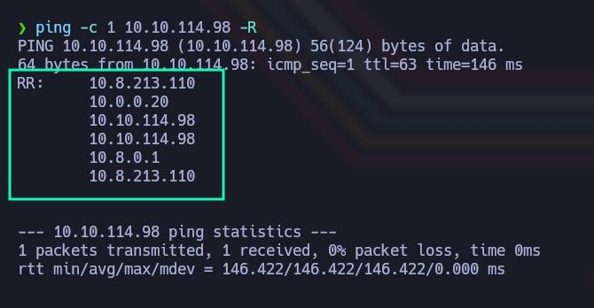

Volviendo a la resolución de la máquina, lo primero que hacemos es ver qué puertos tiene abiertos. Para ello vamos a emplear nmap con los siguientes parámetros. 

```bash
sudo nmap -p- --open -sS -vvv -n -Pn <IP_Objetivo> -oG <Nombre_archivo>
```

- Parámetos de nmap
  - *-p-* Escanea el rango total de puertos (65535). 
  - *--open* Nos reportará solo los puertos abiertos. 
  - *-sS* (TCP SYN), también conocido como TCP SYN scan o Half-Open Scan. Es un tipo de escaneo más sigiloso que otro tipo de escaneos ya que no completa la conexión TCP, evitando en gran medida que se registre en los logs del sistema objetivo. Sin embargo, algunos sistemas de seguridad si que pueden detectar este tipo de escaneo y tomar medidas.
  - *-vvv* Triple verbose, para ver en consola lo que vaya encontrando nmap
  - *-n* Para no aplicar resolución DNS 
  - *-Pn* No realiza detección de Host. Con este parámetro nmap asumirá que los Host especificados están activos. 
  - *-oG* Genera un archivo de salida en formato Greppable, con el nombre que le hayamos especificado

Revisando rápidamente los resultados, vemos lo siguiente

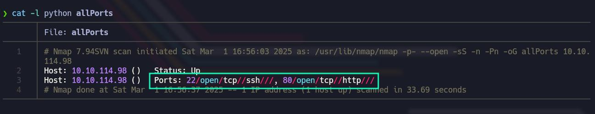

Tal y como vemos en la imagen, encontramos dos puertos abiertos. Por un lado el puerto 22 SSH y por otro lado el puerto 80 HTTP. 

Profundizando más en el análisis de estos dos puertos, vamos a tratar de enumerar el servicio y la versión que corren en cada uno de los dos puertos. También vamos a lanzar el conjunto de scripts básicos de reconocimiento que nmap pone a nuestra disposición empleando el parámetro -sC.

```bash
nmap -sC -sV -p<Puertos_a_Escanear> <IP_Objetivo> -oN <Nombre_Archivo>
```

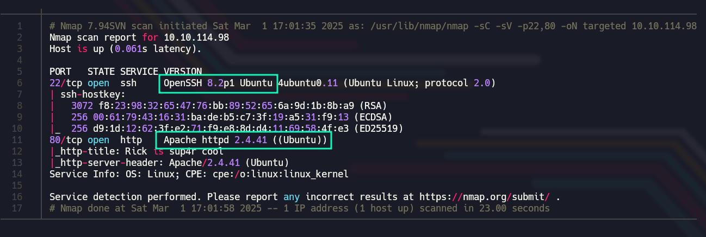

En primer lugar, podemos ver que estamos ante una máquina Ubuntu. Tenemos las versiones de los servicios SSH (7.2) y HTTP (Apache 2.4.18). Podemos tratar de ver en searchsploit o San Google directamente, si existe alguna vulnerabilidad asociada a estas versiones. En cuanto a OpenSSH 7.2, encontramos un vulnerabilidad que nos permite enumerar usuarios válidos, pero no conseguimos nada por esta vía. Todas las versiones de OpenSSH inferiores a la 7.7, son vulnerables. 

Antes de pasar a echarle un vistazo al sitio web, vamos a lanzar Whatweb para tratar de ver las tecnologías que se están empleando por detrás. También puede mostrarnos el CMS, si se está empleando alguno. 

```bash
whatweb http://[IPObjetivo]
```

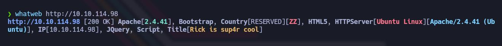

Ahora ya sí, vamos a echarle un vistazo al servicio web a ver qué encontramos. 

```
http://[IPObjetivo]:80
```

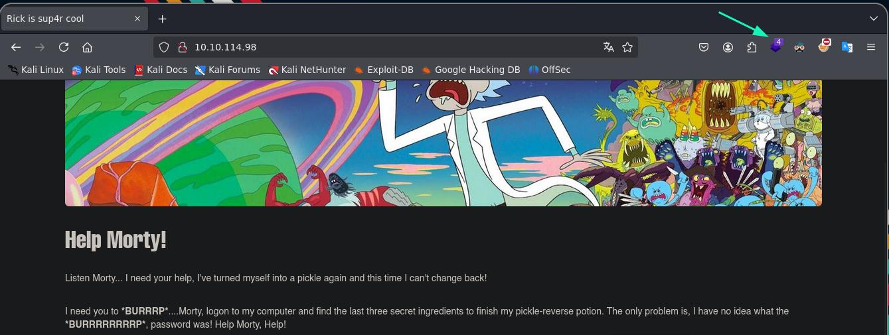

Recordar también que si preferimos podemos utilizar la extensión Wappalyzer como alternativa a la herramienta Whatweb. 

Nos están poniendo un poco en contexto. Nos están pidiendo ayuda para encontrar 3 ingredientes secretos dentro del servidor, para ayudar a Rick a recuperar su apariencia normal o algo así quiero entender. Pues bueno vamos a ponernos a ello. 

Lo primero que hacemos, es revisar el código fuente (CTRL + U) y en un comentario, vemos lo siguiente 

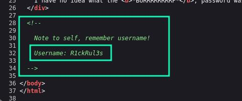

Tenemos un usuario. 

```
Usuario: R1ckRul3s

```

Al no encontrar nada más, decidimos hacer Fuzzing Web para tratar de encontrar algún directorio oculto. De hecho, entre los scripts básicos de reconocimiento que lanzamos antes con nmap, revisando el archivo, no nos ha lanzado el script http-enum (que es uno de los que suele lanzar). Así que lo que vamos a hacer es lanzarlo nosotros de forma manual 

```bash
nmap --script http-enum -p80 [IPObjetivo] -oN [archivo]

```

Si le hacemos un cat al archivo generado, podremos ver los resultados. 

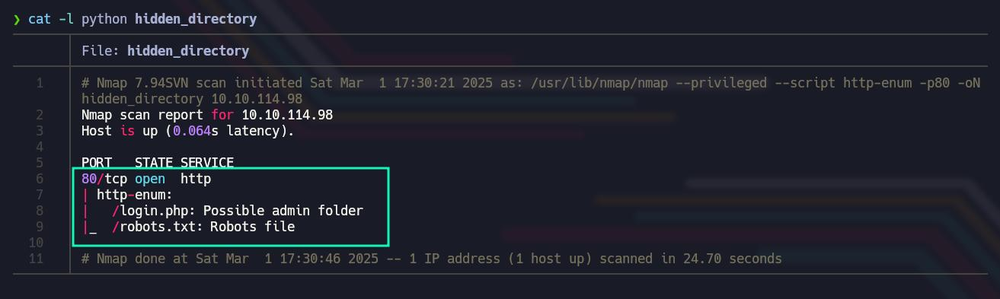

Nos reporta dos directorios interesantes, que obviamente pasamos a revisar 

```
http://[IPObjetivo]:80/robots.txt

```

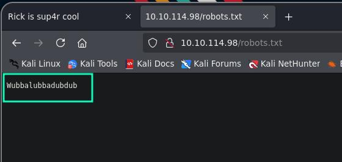

```
Posible Contraseña: Wubbalubbadubdub

```


Ni idea de lo que pueda ser eso, pero tiene pinta de ser una contraseña, o podemos tratar de emplearla como contraseña en el panel de login que vamos a ver a continuación visitando el segundo directorio que nos ha reportado nmap 

```
http://[IPObjetivo]:80/login.php

```

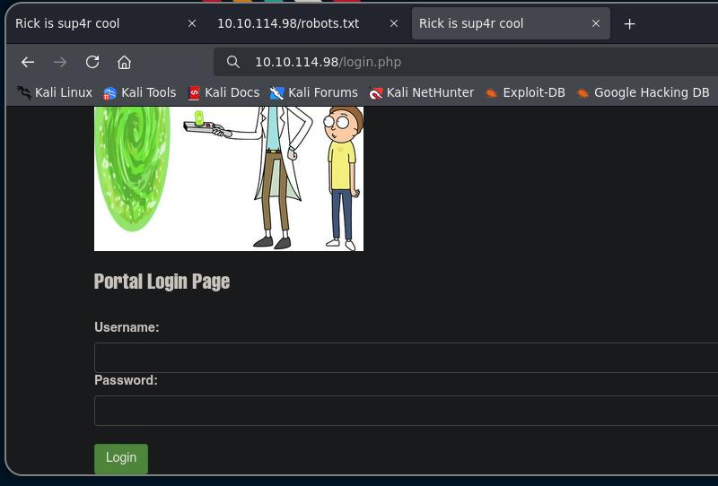

Tenemos un usuario y una cadena rara, que bien podría ser la contraseña, así que vamos a probar suerte 

```
Usuario: R1ckRul3s
Contraseña: Wubbalubbadubdub

```

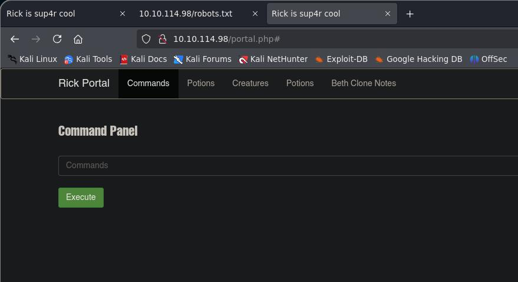

Tenemos un panel en el que se supone que podemos ejecutar comandos. Si probamos a pinchar sobre las demás secciones, nos dirá que solo el verdadero Rick puede hacerlo. 

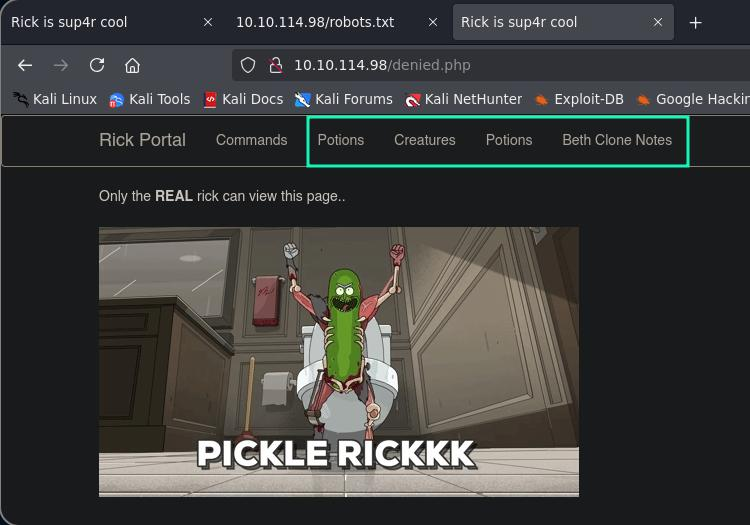

Pues vamos a ingresar comandos a ver que podemos hacer. 

Empezamos ejecutando el comando pwd para ver la ruta del sistema en la que estamos y nos responde lo siguiente 

```bash
pwd

```

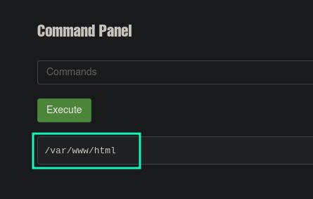

Ahora ejecutamos el comando ip a s, para ver si realmente estamos ejecutando comandos en el servidor, y parecer ser que si 

```bash
ip a s

```
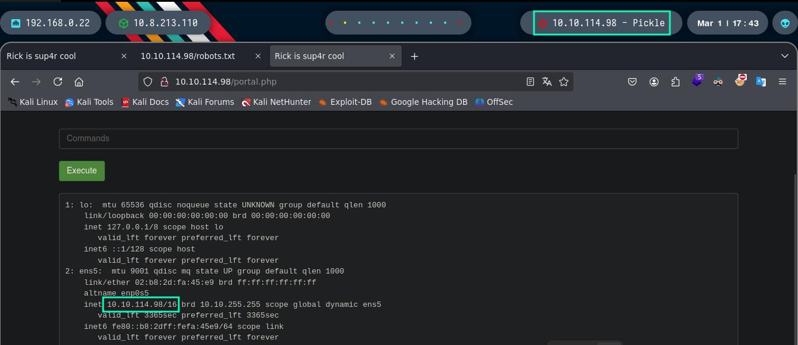

Lo que siguiente que probamos, es listar el contenido del directorio actual, con los archivos ocultos incluidos 

```bash
ls -la

```

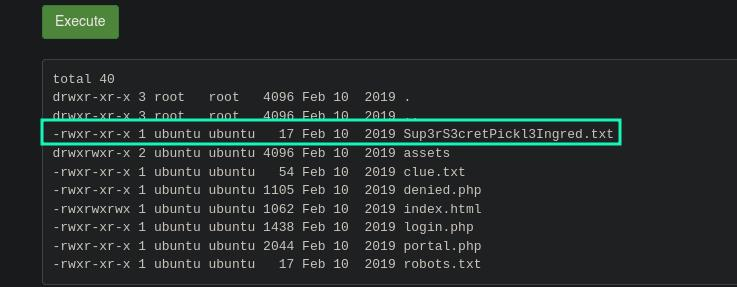

Vemos por ahí un archivo llamado "Sup3rS3cretPickl3Ingred.txt", que parece ser uno de los 3 ingredientes que nos estaban pidiendo que encontráramos. Pues vamos a echarle un vistazo. Luego revisaremos los demás archivos. 

```bash
cat Sup3rS3cretPickl3Ingred.txt

```

Al ejecutar este comando nos informan que el comando cat está deshabilitado. 

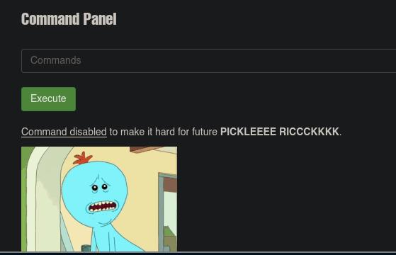

En este punto, decidimos inspeccionar el código fuente (CTRL + U) para ver si nos han dejado otro comentario o algo así. 

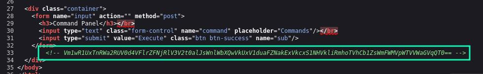

Encontramos efectivamente un comentario, con una cadena que parece ser Base64. Podemos decodificarla desde consola, o con Cyberchef. La cadena ha sido cifrada, unas cuantas veces en Base64, pero al final no nos aporta nada. Es un Rabbit Hole. Una expresión inglesa y común en CTFs, para referirse a una pista falsa o una pista que realmente no nos será útil para la resolución de la máquina. 

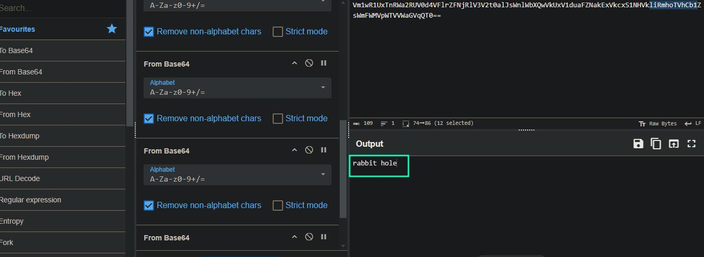

Como nos dicen que el comando cat está deshabilitado, lo que podemos hacer es buscar alguna otra alternativa. Cat lo que nos hace es mostrar el contenido de un archivo, pero conociendo un poco Linux, rápidamente damos con posibles soluciones. 

```
less Sup3rS3cretPickl3Ingred.txt

```

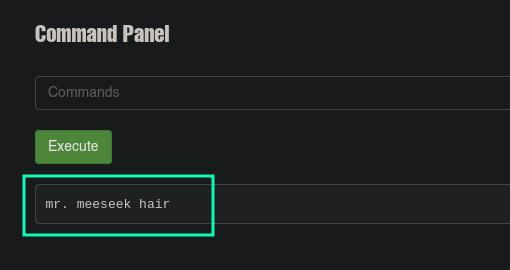

Otra alternativa es por ejemplo la siguiente 

```bash
nl Sup3rS3cretPickl3Ingred.txt

```

nl lo que hace es igual que cat, pero nos muestra el archivo con números de línea.

De hecho, otra forma de hacer esto y poder leer este archivo incluso sin necesitar ejecutar ningún comando, es la siguiente. Al listar los archivos del directorio actual, que era /var/www/HTML, veíamos que había una serie de archivos , que directamente pueden ser visualizados desde la URL del navegador. Pues nada, ingresamos la siguiente URL, llamando al archivo "Sup3rS3cretPickl3Ingred.txt" y como vemos en la imagen, podemos verlo sin problemas 

```
http://[IPObjetivo]:80/Sup3rS3cretPickl3Ingred.txt

```

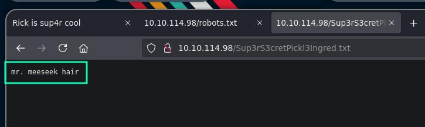

Tenemos el primer ingrediente. 

Como decíamos, vamos a revisar los demás archivos, que de hecho había uno llamado "clue.txt", así que vamos a leer esa pista. En este caso, lo haremos desde el navegador, pero podemos hacerlo de las dos formas que hemos visto 

```
http://[IPObjetivo]:80/clue.txt

```

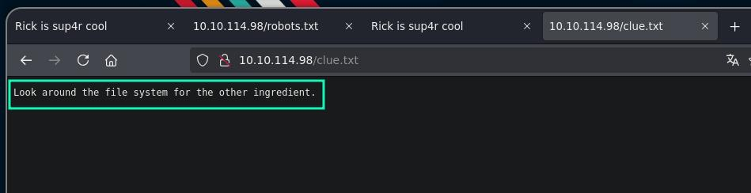

Nos dicen que busquemos alrededor del sistema de archivos en busca del otro ingrediente. En este punto, se me ocurre tirar del comando find. Podemos tratar de buscar archivos desde la raíz, y filtrar por palabras clave como "second" o "ingredient", que son palabras que supongo que contendrá el archivo que tenemos que buscar. Vamos a ponerlo a prueba

```
find / -type f -name "*ingredient*" 

```

Lo que estamos haciendo es decirle a find que desde el directorio raíz, nos busque archivos que contengan la palabra "ingredient". Con el asterisco antes y después de la palabra, le indicamos que antes y después de la misma, puede haber cualquier texto. 

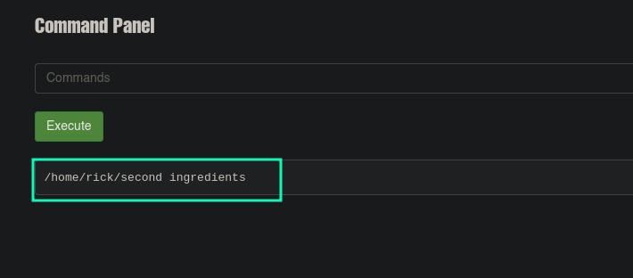

Como vemos, nos devuelve la ruta en la que hay un archivo llamado "second ingredients", por lo que con less por ejemplo, vamos a ver su contenido. OJO CUIDADO con esta ruta, porque el nombre del archivo contiene espacios, y esto puede darnos un poco la lata si no conocemos un poco sobre Linux. Tenemos que escaparlos, y ahora vamos a ver como se haría. 

```bash
less /home/rick/second\ ingredients

```
Como vemos, hemos puesto *(\)* para escapar el espacio en el nombre del archivo, ya que si no, less interpretaría cada nombre por separado y no funcionaría. Otra forma de escapar los espacios, es por ejemplo metiendo el archivo, o mejor dicho, la ruta que contiene el archivo, entre comillas simples o dobles

```bash
less '/home/rick/second ingredients'

```

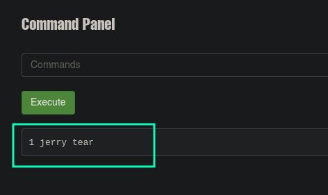

Pues tenemos el segundo Ingrediente. Nos falta el tercero y último. 


No sería de extrañar, que el archivo que contiene el tercer ingrediente sea propiedad del usuario root, pero tratando de listar el contenido de su directorio y empleando el comando find para hacer búsquedas personalizadas, no nos muestra nada. En este punto, quizás tengamos que elevar los privilegios de alguna forma. Así que ejecutamos el siguiente comando para ver los permisos de sudo del usuario actual 

```
sudo -l 

```

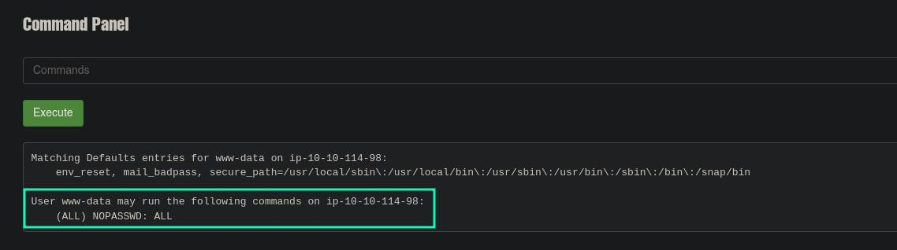

Como vemos, el usuario www-data, es decir, nosotros, podemos ejecutar como root todos los comandos del sistema. Pues ya está, la clave es emplear sudo antes del comando simplemente. Ahora con privilegios de root, vamos a listar el contenido del directorio personal de root. 

```bash
sudo ls -la /root/

```

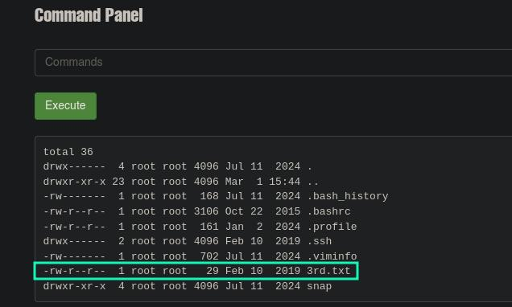

Como vemos, ahora ya si que podemos ver los archivos del directorio /root/. Vemos un archivo un tanto curioso por su nombre "3rd.txt", que supongo que será el tercer ingrediente que nos faltaba por encontrar. 

```bash
sudo less /root/3rd.txt

```


Ya con el tercer y último ingrediente, damos por finalizado este CTF. 


